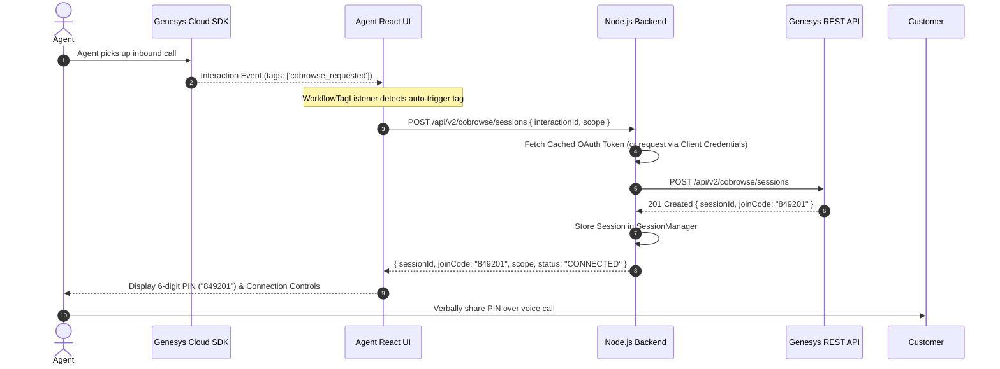
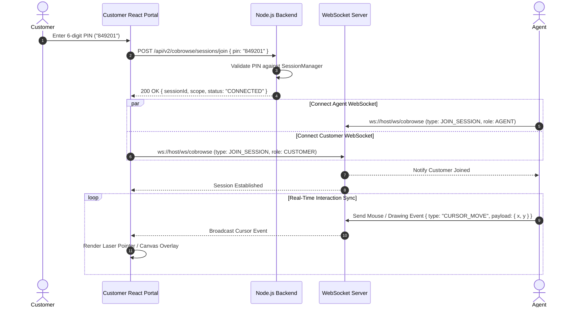
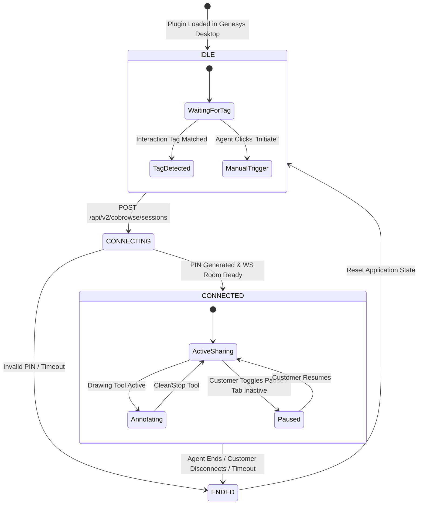
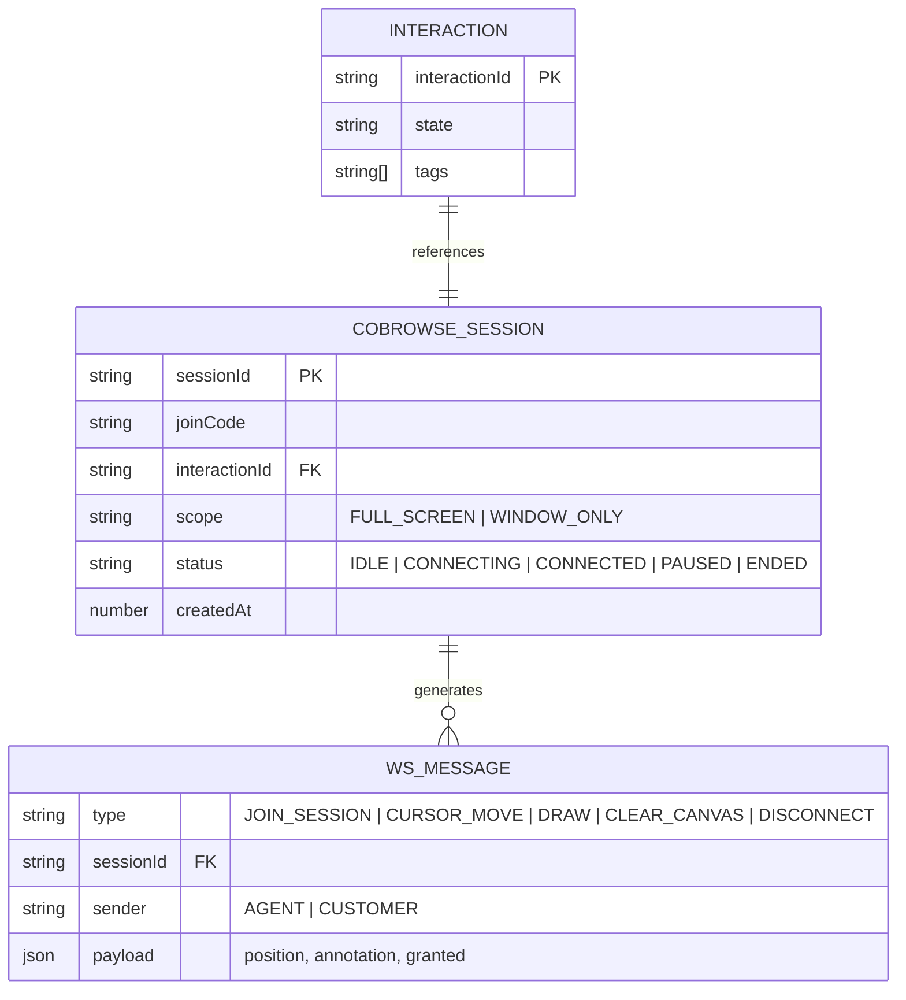

# 🚀 Genesys Cloud Co-Browse Integration Plugin

A production-ready, full-stack scaffold for embedding real-time **Genesys Cloud Co-Browse** capabilities into agent desktops and providing a zero-login landing experience for end customers.

---

## 📑 Table of Contents

* [Overview](https://www.google.com/search?q=%23-overview&utm_source=gemini)
* [Architecture & Diagrams](https://www.google.com/search?q=%23-architecture--diagrams&utm_source=gemini)
* [System Architecture](https://www.google.com/search?q=%231-system-architecture&utm_source=gemini)
* [Session Initialization & Tag Auto-Trigger Flow](https://www.google.com/search?q=%232-session-initialization--tag-auto-trigger-flow&utm_source=gemini)
* [Customer PIN Join & WebRTC Signaling Flow](https://www.google.com/search?q=%233-customer-pin-join--webrtc-signaling-flow&utm_source=gemini)
* [Co-Browse Session Lifecycle State Machine](https://www.google.com/search?q=%234-co-browse-session-lifecycle-state-machine&utm_source=gemini)
* [Data Model & Entities](https://www.google.com/search?q=%235-data-model--entities&utm_source=gemini)


* [Features](https://www.google.com/search?q=%23-features&utm_source=gemini)
* [Project Structure](https://www.google.com/search?q=%23-project-structure&utm_source=gemini)
* [Getting Started](https://www.google.com/search?q=%23-getting-started&utm_source=gemini)
* [Configuration](https://www.google.com/search?q=%23-configuration&utm_source=gemini)
* [API Reference](https://www.google.com/search?q=%23-api-reference&utm_source=gemini)

---

## 🔍 Overview

This plugin facilitates real-time co-browsing between customer service agents operating inside Genesys Cloud and unauthenticated end users. Key features include:

* **Genesys Cloud Interaction Listener**: Automatically triggers or suggests co-browse sessions based on workflow tags attached to an active interaction.
* **Agent Desktop Integration**: Embedded iframe app built with React + TypeScript using the official PureCloud Client App SDK.
* **Customer Landing Portal**: Zero-authentication, PIN-based entry page with DOM/input privacy masking.
* **Real-Time Signaling**: Node.js WebSocket server managing bi-directional laser pointer movements, annotations, and remote interaction requests.

---

## 📊 Architecture & Diagrams

### 1. System Architecture

```mermaid
graph TB
    subgraph GenesysCloud["Genesys Cloud Platform"]
        GC_API["Genesys Cloud REST API<br/>(/v2/cobrowse/sessions)"]
        GC_SDK["PureCloud Client App SDK"]
    end

    subgraph AgentDesktop["Agent Desktop (iframe App)"]
        ReactAgent["React Agent UI"]
        AgentHook["useGenesysSDK Hook"]
        AgentWS["Signaling Client"]
    end

    subgraph CustomerBrowser["Customer Browser"]
        ReactCustomer["React Customer Portal"]
        PrivacyMask["Privacy & DOM Masking Layer"]
        CustomerWS["Signaling Client"]
    end

    subgraph BackendServer["Node.js / Express Backend"]
        ExpressRoutes["REST API Routes"]
        SessionMgr["In-Memory / Redis Session Store"]
        TokenVault["Genesys Token Vault (OAuth2)"]
        WSServer["WebSocket Signaling Server"]
    end

    %% Connections
    ReactAgent -->|Subscribes to Tags| AgentHook
    AgentHook <-->|IPC / Events| GC_SDK
    ReactAgent -->|REST Requests| ExpressRoutes
    ExpressRoutes -->|Authenticate & Mint Token| TokenVault
    TokenVault <-->|OAuth2 Client Credentials| GC_API
    ExpressRoutes -->|Create/Store Session| SessionMgr

    ReactCustomer -->|POST /sessions/join| ExpressRoutes
    AgentWS <-->|WebSockets (/ws/cobrowse)| WSServer
    CustomerWS <-->|WebSockets (/ws/cobrowse)| WSServer
    WSServer <-->|Sync State & Annotations| SessionMgr

    classDef genesys fill:#ffefeb,stroke:#ff4f00,stroke-width:2px,color:#1e293b;
    classDef client fill:#e0f2fe,stroke:#0284c7,stroke-width:2px,color:#1e293b;
    classDef server fill:#f0fdf4,stroke:#16a34a,stroke-width:2px,color:#1e293b;

    class GC_API,GC_SDK genesys;
    class ReactAgent,AgentHook,AgentWS,ReactCustomer,PrivacyMask,CustomerWS client;
    class ExpressRoutes,SessionMgr,TokenVault,WSServer server;

```

---

### 2. Session Initialization & Tag Auto-Trigger Flow



---

### 3. Customer PIN Join & WebRTC Signaling Flow



---

### 4. Co-Browse Session Lifecycle State Machine



---

### 5. Data Model & Entities



---

## ✨ Features

* 🎯 **Automatic Workflow Tag Triggers**: Auto-initiates co-browse when a tag such as `cobrowse_requested` is added to the call.
* 🔒 **Privacy First**: Sensitive fields (`type="password"`, `.cobrowse-mask`) are masked DOM elements on the customer end.
* 🖥️ **Flexible Scopes**: Supports both `FULL_SCREEN` and `WINDOW_ONLY` sharing modes.
* 🎨 **Real-Time Annotations**: Canvas overlay for laser pointers, drawing lines, and highlighting specific sections.
* ⚡ **Zero Customer Authentication**: Simple 6-digit PIN authentication landing page.

---

## 📁 Project Structure

```text
genesys-cobrowse-plugin/
├── client/                      # Frontend (React + TypeScript + Vite)
│   ├── src/
│   │   ├── components/
│   │   │   ├── agent/           # Agent Desktop components
│   │   │   ├── customer/        # Unauthenticated landing page components
│   │   │   ├── shared/          # Canvas overlays, laser pointers, status badges
│   │   │   └── ui/              # Base UI Kit
│   │   ├── hooks/               # Custom React Hooks (useGenesysSDK, useWebSocket)
│   │   ├── services/            # API & Signaling Services
│   │   └── types/               # TypeScript Definitions
│   └── package.json
│
└── server/                      # Backend (Node.js + Express + WebSocket + TS)
    ├── src/
    │   ├── config/              # Environment & Genesys Auth URLs
    │   ├── controllers/         # Co-browse REST Route Handlers
    │   ├── routes/              # Express Router
    │   ├── services/            # Genesys Client SDK & Session Manager
    │   ├── sockets/             # Real-time WebSocket Hub
    │   └── utils/               # Token Vault & Logger
    └── package.json

```

---

## 🚀 Getting Started

### Prerequisites

* **Node.js**: `v18.x` or higher
* **npm** or **yarn**
* **Genesys Cloud Account**: OAuth2 Client Credentials with Co-Browse permissions (`cobrowse:session:add`, `cobrowse:session:edit`).

### 1. Installation

Clone the repository and install dependencies for both client and server:

```bash
# Clone repository
git clone https://github.com/your-org/genesys-cobrowse-plugin.git
cd genesys-cobrowse-plugin

# Install Client Dependencies
cd client
npm install

# Install Server Dependencies
cd ../server
npm install

```

### 2. Environment Setup

Create a `.env` file in the `server/` directory:

```env
PORT=5000
NODE_ENV=development
GENESYS_CLIENT_ID=your-genesys-client-id
GENESYS_CLIENT_SECRET=your-genesys-client-secret
GENESYS_ENVIRONMENT=mypurecloud.com

```

### 3. Running Locally

Start the backend server:

```bash
cd server
npm run dev

```

In a second terminal, start the frontend development server:

```bash
cd client
npm run dev

```

Access the app at: `http://localhost:3000`

---

## 📡 API Reference

### Backend Endpoints

| Method | Endpoint | Description |
| --- | --- | --- |
| `POST` | `/api/v2/cobrowse/sessions` | Initiates a new session via Genesys Cloud API |
| `POST` | `/api/v2/cobrowse/sessions/join` | Validates a customer's 6-digit PIN |
| `POST` | `/api/v2/cobrowse/sessions/:sessionId/end` | Terminates an active co-browse session |
| `GET` | `/health` | Healthcheck endpoint |

---

## 📄 License

Distributed under the MIT License. See `LICENSE` for more information.